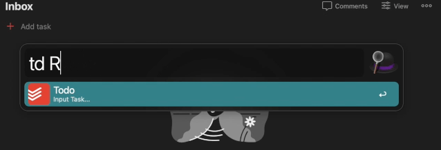

# tod Alfred Wrapper

An [Alfred](https://www.alfredapp.com/) wrapper for the [tod](https://github.com/alanvardy/tod) application.

Allows you to quickly create tasks from an Alfred Shortcut into Todoist using [tod](https://github.com/alanvardy/tod).  
tod allows for natural language processing, so you can include labels, projects, due dates, and descriptions.

## Automatic Installation

1) Download the latest workflow from releases and install
2) Run "td-setup" and follow the prompts for the inital config (including downloading Rust, TOD, and configuring your API key).
3) Once you recive the "Configuration completed successfully! Please check your Todoist Inbox!" message, and a "Alfred Test Task" shows up in your Inbox due for today, you can begin using the workflow.

### Manual Installation

If you would like to install manually:
1) [Install tod](https://github.com/alanvardy/tod) (and the dependencies)
2) Configure tod and follow the prompts to enter your [API key](https://todoist.com/app/settings/integrations) and configure your Timezone.
```bash
tod -l
```
3) Download the latest Alfred workflow from [Releases](https://github.com/stacksjb/AlfredTodWorkflow/releases) and add to Alfred
4) Configure your shortcut (td by default) and any notification sound(s)

## Usage

1) Press your Alfred Shortcut, and create the task using "td taskname", where task name is the task.  
* The field supports natural language processing, so you can include the following:
  * labels (@label)
  * projects (#projectname) (Project must already exist)
  * due dates (due tomorrow
  * descriptions ( //description)




### Examples
* "Respond to Jim's marketing email" : creates a new task in the Inbox titled "Respond to Jim's marketing email"
* "Clean my room on tuesday at 1pm p2" : creates a task named "Clean my room" due on Tuesday at 1pm, with Priority of 2
* "Ship UPS Package #eBay @errands p2 tomorrow" : creates a task in the eBay project, anerrands label, priority of 2, due tomorrow.
* "Purchase apples //Granny Smith" : creates a task in the Inbox named "Purchase apples" with a description of "Granny Smith"

For more guidelines on how to use natural language processing, see (https://www.leightonprice.com/todoist/dates.htm or https://thesweetsetup.com/using-natural-language-with-todoist/)

## Why I made this

I actively utilize the [Getting Things Done](https://en.wikipedia.org/wiki/Getting_Things_Done) method. One of my system requirements is that I am able to enter my ideas and tasks quickly into my Inbox system (in this case, the Todoist Inbox) in 3 steps (or less) at any given time.

This tool provides that input functionality for me anytime I am working at my computer.

## Credits

All credit goes to [@alanvardy](https://github.com/alanvardy/tod) and his tod application, which provides the underlying framework (and does all the heavy lifting) for the task creation.
